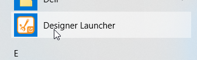

<!DOCTYPE html>
<html>
<body>
  <!-- HEADER/NAME -->
  <h1 id="name">Ewon Ignition Demo</h1>

  <!-- TABLE OF CONTENTS -->
  <h2 id="toc">Table of Contents</h2>

  <ol>
    <li><a href="#information">Information</a>
      <ol>
        <li><a href="#about">About</a></li>
        <li><a href="#system-design">System Design</a></li>
        <li><a href="#trademark-information">Trademark Information</a></li>
      </ol>
    </li>
    <li><a href="#getting-started">Getting Started</a>
      <ol>
        <li><a href="#prerequisites">Prerequisites</a></li>
      </ol>
    </li>
    <li><a href="#installation">Installation</a>
      <ol>
        <li><a href="#ewon-setup">Ewon Setup</a></li>
        <li><a href="#ignition-setup">Ignition Setup</a></li>
      </ol>
    </li>
    <li><a href="#usage">Usage</a></li>
    <li><a href="#troubleshooting">Troubleshooting</a>
      <ol>
        <li><a href="#cannot-log-in-trial-expired">Cannot log in, trial expired</a></li>
        <li><a href="#error-writing-to-tag-bad_notfound">Error writing to tag, Bad_NotFound<a/></li>
      </ol>
    </li>
    <li><a href="#appendices">Appendices</a>
      <ol>
        <li><a href="#setting-up-an-ewon">Setting Up an Ewon</a></li>
        <li><a href="#obtaining-a-talk2m-developer-id">Obtaining a Talk2M Developer ID</a></li>
        <li><a href="#accessing-an-ewon-devices-webpage">Accessing an Ewon Device's Webpage</a></li>
        <li><a href="#installing-and-configuring-ignition">Installing and Configuring Ignition</a></li>
        <li><a href="#restarting-ignition">Restarting Ignition</a></li>
        <li><a href="#obtaining-an-ewons-name">Obtaining an Ewon's Name</a></li>
      </ol>
    </li>
  </ol>

  <!-- INFORMATION -->
  <h2 id="information">Information</h2>

  <!-- INFORMATION/ABOUT -->
  <h3 id="about">About</h3>
  
The Ewon Ignition Demo showcases the features of integrating the HMS Networks’ Ewon platform with Inductive Automation's Ignition SCADA system.

  
The Ewon Ignition Demo was developed and is maintained by HMS Networks, using the Ewon Java library. For more information about this demo and developing applications with the Ewon Java library, please visit the Ewon Developer website at <a href="https://developer.ewon.biz/" class="uri">https://developer.ewon.biz/</a> or contact us at <a href="mailto:us-services@hms.se">us-services@hms.se</a>.

  <!-- INFORMATION/SYSTEM DESIGN -->
  <h3 id="system-design">System Design</h3>
  
The Ewon Ignition Demo is a two-part system consisting of an Ewon application and an Ignition Designer project.

  
The Ewon-side application uses FTP to configure tags on the Ewon, then creates simulated tag data and applies it to the Ewon’s tags using the Ewon Java library.

  
The Ignition Designer project accesses the data created by the demo’s Ewon application and displays it in realistic dashboards that are designed to mimic those of a real system.

  <h3 id="trademark-information">Trademark Information</h3>
  
<small>Ewon&reg; is a registered trademark of HMS Industrial Networks SA. Microsoft&reg; and Windows&reg; are registered trademarks of Microsoft Corporation in the United States and/or other countries. Inductive Automation&reg; is a registered trademark of Inductive Automation, LLC. All other trademarks mentioned in this document are the property of their respective holders.</small>

  <!-- GETTING STARTED -->
  <h2 id="getting-started">Getting Started</h2>

  <!-- GETTING STARTED/PREREQUISITES -->
  <h3 id="prerequisites">Prerequisites</h3>
  
These are the items required for the installation and use of the Ewon Ignition Demo.

  <ul>
    <li>
      
<strong>Configured Ewon Flexy Device</strong>

      <ul>
        <li>
          
For information on how to set up and configure your Ewon device, please refer to <em><a href="#setting-up-an-ewon">Appendix 6.1, Setting Up an Ewon</a>.</em>

        </li>
      </ul>
    </li>
    <li>
      
<strong>PC/Computer</strong>

    </li>
    <li>
      
<strong>Ewon Developer ID</strong>

      <ul>
        <li>
          
For information on how to request and obtain an Ewon Developer ID, please refer to <a href="#obtaining-a-talk2m-developer-id"><em>Appendix 6.2, Obtaining a Talk2M Developer ID</em>.</a>

        </li>
      </ul>
    </li>
    <li>
      
<strong>Ewon Ignition Demo Resource Pack</strong>

      <ul>
        <li>
          
Download the latest release from <a href="https://github.com/hms-networks/FlexyIgnitionDemo/releases" class="uri">https://github.com/hms-networks/FlexyIgnitionDemo/releases</a> and extract.

        </li>
      </ul>
    </li>
  </ul>

  <!-- INSTALLATION -->
  <h2 id="installation">Installation</h2>

  <!-- INSTALLATION/EWON SETUP -->
  <h3 id="ewon-setup">Ewon Setup</h3>
  
<em>During Ewon setup, you’ll need access to your Ewon device’s webpage. For information on accessing an Ewon device’s webpage, please refer to <a href="#accessing-an-ewon-devices-webpage">Appendix 6.3, Accessing an Ewon Device’s Webpage</a>.</em>

  
<strong>Step 1:</strong> Using your Ewon device’s webpage, open the user account settings by selecting <code>Setup</code> &gt; <code>Users</code> in the menu on the left.

  
   

  
<strong>Step 2:</strong> Create a new user account with the following information. Do not modify user rights.

  
<code>User Login</code>: <em>demo</em> 
  <code>Password</code>: <em>demopassword</em> 
  <code>Confirm Password</code>: <em>demopassword</em>

  
<strong>NOTE:</strong> This user account is required for Ewon Ignition Demo to function and allows the demo to configure tags on your Ewon device.

  
   

  
<strong>Step 3:</strong> Open an FTP connection to your Ewon device using your operating system’s file manager (i.e. File Explorer).

  
To do this, type the following address in the address bar, replace “[EWON IP HERE]” with the IP address you use to access your Ewon device’s webpage, then hit Enter/Return. <em>If required, enter the username/password you use to access your Ewon device’s webpage.</em>

  
<code>Address</code>: <em>ftp://[EWON IP HERE]</em>

  
   

  
<strong>Step 4:</strong> Using the created FTP connection, copy the files <code>EwonIgnitionDemoApp.jar</code> and <code>jvmrun</code> from the demo resource pack to the <code>usr</code> folder on your Ewon device.

  
   

  
<strong>Step 5:</strong> Reboot your Ewon device by disconnecting and reconnecting power, or by selecting <code>Setup</code> &gt; <code>Reboot</code> on your Ewon device’s webpage.

  

  <!-- INSTALLATION/IGNITION SETUP -->
  <h3 id="ignition-setup">Ignition Setup</h3>
  
<em>During Ignition Setup, you’ll need access to your Ignition gateway’s webpage. For information on installing and accessing Ignition, please refer to <a href="#installing-and-configuring-ignition">Appendix 6.4, Installing and Configuring Ignition</a>.</em>

  
<strong>Step 1:</strong> Download and install the latest version of the Ignition Ewon Connector from the IgnitionEwonConnector GitHub repository, found here: <a href="https://github.com/hms-networks/IgnitionEwonConnector" class="uri">https://github.com/hms-networks/IgnitionEwonConnector</a>.

  
For instructions on how to download and install the connector, please refer to the “Download”, “Installation” and “Ewon Setup” sections of the Ignition Ewon Connector GitHub repository.

  
<strong>NOTE:</strong> You may omit the “Setup Historical Logging for Tags” step in “Ewon Setup.”

  

   

  
<strong>Step 2:</strong> After the Ignition Ewon Connector has installed, open the Ewon Connector configuration webpage by selecting <code>Config</code> &gt; <code>TAGS</code> &gt; <code>Ewon Connector</code>, and populate the following fields.

  
<code>General/Name</code>: <em>Ewon</em> 
  <code>General/Enabled</code>: <em>Checked/True</em> 
  <code>General/Tag Names Contain Periods?</code>: <em>Unchecked/False</em> 
  <code>General/Poll Rate in Minutes</code>: <em>1</em> 
  <code>General/Realtime Poll Rate in Seconds</code>: <em>1</em>

  
<code>Talk2M Account Information/Account</code>: <em>[Your Talk2M Account Name]</em> 
  <code>Talk2M Account Information/Username</code>: <em>[Your Talk2M Username]</em> 
  <code>Talk2M Account Information/Password</code>: <em>[Your Talk2M Password]</em> 
  <code>Talk2M Account Information/Talk2M Developer ID</code>: <em>[Your Talk2M Developer ID]</em>

  
<code>Ewon Device Information/Ewon Username</code>: <em>[Your Ewon Device Username]</em> 
  <code>Ewon Device Information/Password</code>: <em>[Your Ewon Device Password]</em>

  
<code>History/History Enabled</code>: <em>Unchecked/False</em> 
  <code>History/Target History Provider</code>: <em>Choose One</em>

  
<code>Advanced/Read all values in realtime</code>: <em>Checked/True</em>

  
For detailed instructions and further information on configuring the Ewon Connector, please refer to the “Connector Setup” section of the Ignition Ewon Connector GitHub repository, found here: <a href="https://github.com/hms-networks/IgnitionEwonConnector" class="uri">https://github.com/hms-networks/IgnitionEwonConnector</a>.

   

  
<strong>Step 3:</strong> After populating the Ewon Connector configuration fields, save the changes and restart Ignition.

  
To restart Ignition, it’s easiest to restart your PC. For information on manually restarting Ignition without a PC restart, please refer to <em><a href="#restarting-ignition">Appendix 6.5, Restarting Ignition</a>.</em>

  
   

  
<strong>Step 4:</strong> After Ignition has restarted, open the Ignition project configuration webpage by selecting <code>Config</code> &gt; <code>SYSTEM</code> &gt; <code>Projects</code>, then click <code>Import Project</code>.

  
   

  
<strong>Step 5:</strong> Select <code>Choose File</code> and choose <code>EwonIgnitionDemo.zip</code> from the demo resource pack. Enter a project name of your choice, then click <code>Import</code> to add the Ewon Ignition Demo to your Ignition gateway.

  
<strong>NOTE:</strong> Project names must not contain spaces or special characters.

  
   

  
<strong>Step 6:</strong> Download and install Ignition Designer Launcher by selecting <code>Get Designer</code> in the upper right corner of your gateway’s webpage. Once the download is complete, open the installer and install Ignition Designer Launcher.

  
<strong>NOTE:</strong> If you’re using an operating system other than Microsoft Windows, your download button may be different.

  
   

  
<strong>Step 7:</strong> After installation of Ignition Designer Launcher is complete, launch Ignition Designer Launcher from your operating system’s application menu.

  
   

  
<strong>Step 8:</strong> Click <code>Add Designer</code> and select your Ignition gateway, then click <code>Add Selected Gateway</code>. Alternatively, if a “Gateway Match Found” notice pops up, select <code>Yes</code> to automatically add your Ignition gateway and its projects to Ignition Designer Launcher.

  
   

  <!-- USAGE -->
  <h2 id="usage">Usage</h2>

  
<strong>Step 1:</strong> If it’s not already open, launch Ignition Designer Launcher from your operating system’s application menu.

  
   

  
<strong>Step 2:</strong> Launch the designer for your gateway by clicking <code>Launch</code>, then log in with your Ignition gateway’s username and password.

  
   

  
<strong>Step 3:</strong> After the “Open/Create Project” window loads, select the <code>HMS-Ewon-Ignition-Demo</code> project under <code>Open Recent</code>, then click <code>Open Project</code>.

  
   

  
<strong>Step 4:</strong> After the designer window loads, launch the project by selecting either <code>Launch (windowed)</code> or <code>Launch (full-screen)</code> in <code>Tools</code> &gt; <code>Launch Project</code>.

  
   

  
<strong>Step 5:</strong> After the project has finished launching, log in with your Ignition gateway’s username and password.

  
   

  
<strong>Step 6:</strong> Enter the requested information, and click <code>Begin</code> to activate the demo.

  
For information on obtaining your Ewon Name, please refer to <em><a href="#obtaining-an-ewons-name">Appendix 6.6, Obtaining an Ewon’s Name</a>.</em>

  

  <!-- TROUBLESHOOTING -->
  <h2 id="troubleshooting">Troubleshooting</h2>
  
<em>For additional troubleshooting information and to find troubleshooting information not found in this guide, please visit the Ewon Ignition Demo wiki, located at <a href="https://github.com/hms-networks/FlexyIgnitionDemo/wiki" class="uri">https://github.com/hms-networks/FlexyIgnitionDemo/wiki</a>.</em>

  <!-- TROUBLESHOOTING/TRIAL EXPIRED -->
  <h3 id="cannot-log-in-trial-expired"><strong>Cannot log in, trial expired</strong></h3>
  
If you encounter this error, you’ve likely run out of time on your Ignition gateway’s demo period. To resolve, you’ll need to open your Ignition gateway’s webpage and click <code>Reset</code> on the Trial Mode bar. If you’re not signed in to the Ignition gateway webpage, you may need to click <code>Sign In to Reset</code> instead of <code>Reset</code>.

  
   

  <!-- TROUBLESHOOTING/TAG NOT FOUND -->
  <h3 id="error-writing-to-tag-bad_notfound">Error writing to tag, Bad_NotFound</h3>
  
If you encounter this error, there’s a problem accessing your Ewon’s tags. To resolve, you’ll need to verify that you’ve entered the correct Ewon name when entering the demo.

  
If you’ve entered the correct name, but still receive this error, there may be a problem with the Ewon Connector or its configuration. For information on resolving errors with the Ewon Connector, visit the Ignition Ewon Connector GitHub readme at <a href="https://github.com/hms-networks/IgnitionEwonConnector/blob/Ignition-8-master/readme.md" class="uri">https://github.com/hms-networks/IgnitionEwonConnector/blob/Ignition-8-master/readme.md</a> and choose the troubleshooting section.

  
   

  <!-- APPENDICES -->
  <h2 id="appendices">Appendices</h2>

  <!-- APPENDICES/EWON SETUP -->
  <h3 id="setting-up-an-ewon">Setting Up an Ewon</h3>
  
Before installation and configuration of the Ewon Ignition Demo, the Ewon must be set up and configured to connect to Talk2M. The <code>System</code>, <code>Internet</code>, and <code>VPN</code> wizards are required to be completed to allow this functionality.

  
For more information, and to obtain detailed instructions, please refer to section 6 of the Ewon device’s installation guide.

  
<strong>Flexy 205 Installation Guide:</strong> <a href="https://websupport.ewon.biz/sites/default/files/ig-0028-00-en-installation-guide-for-flexy-205.pdf#page=22"><em>https://websupport.ewon.biz/sites/default/files/ig-0028-00-en-installation-guide-for-flexy-205.pdf#page=22</em></a> 
  <strong>Flexy Base Unit Installation Guide:</strong> <em><a href="https://websupport.ewon.biz/sites/default/files/ig-014-0-en-ewon_flexy_-_base_units.pdf#page=28" class="uri">https://websupport.ewon.biz/sites/default/files/ig-014-0-en-ewon_flexy_-_base_units.pdf#page=28</a></em>

   

  <!-- APPENDICES/TALK2M DEV ID -->
  <h3 id="obtaining-a-talk2m-developer-id">Obtaining a Talk2M Developer ID</h3>
  
For security reasons, a Talk2M Developer ID is required to access Talk2M services and is required to use the Ewon Ignition Demo.

  
 To obtain a Talk2M Developer ID and to learn more information, please visit the Talk2M Developer ID registration page at <a href="http://developer.ewon.biz/registration" class="uri">http://developer.ewon.biz/registration</a>.

   

  <!-- APPENDICES/ACCESSING EWON WEBPAGE -->
  <h3 id="accessing-an-ewon-devices-webpage">Accessing an Ewon Device’s Webpage</h3>
  
To access your Ewon device’s webpage, you’ll need to connect your PC to your Ewon’s LAN. If you know the IP address of your Ewon device, you can connect to the Ewon device’s webpage by entering its IP address in your web browser. If you do not know its IP address, or you are unsure, launch eBuddy and locate your Ewon device in the list. Then, right-click the Ewon device and select <code>Open in Browser</code>.

   

  <!-- APPENDICES/INSTALLING IGNITION -->
  <h3 id="installing-and-configuring-ignition">Installing and Configuring Ignition</h3>
  
To download Ignition, please visit the Induction Automation downloads webpage in your web browser at <a href="https://inductiveautomation.com/downloads" class="uri">https://inductiveautomation.com/downloads</a>.

  
For information on how to install Ignition and access Ignition’s web page, please visit the Ignition quick start guide at <a href="https://docs.inductiveautomation.com/display/DOC80/Quick+Start+Guide" class="uri">https://docs.inductiveautomation.com/display/DOC80/Quick+Start+Guide</a>.

  
<strong>NOTE:</strong> The Ignition Quick Start Guide contains various sections, some of which are not related to the Ewon Ignition Demo. For the Ewon Ignition Demo, it is only necessary to follow the instructions and information found in section 1, “Download and Install Ignition” and section 2, “Launch the Gateway Webpage.” During Ignition installation, you may choose “Typical” installation.

   

  <!-- APPENDICES/RESTARTING IGNITION -->
  <h3 id="restarting-ignition">Restarting Ignition</h3>
  
Ignition can be restarted using two methods, listed below.

  
<strong>Method 1 (Easiest):</strong> Restart your PC.

  
<strong>Method 2 (Advanced)</strong>: On Microsoft Windows operating systems, browse to <code>C:\Program Files\Inductive Automation\Ignition</code>, and run the <code>stop-ignition.bat</code> script to stop the Ignition gateway process. Once the <code>stop-ignition.bat</code> script finishes running and closes, run the <code>start-ignition.bat</code> script to start the Ignition gateway process again. On Linux operating systems, browse to <code>/usr/local/bin/ignition</code> and run the <code>ignition.sh</code> script with the restart parameter, <code>./ignition.sh restart</code>

  
<strong>NOTE:</strong> If you customized the Ignition installation directory or are using an operating system not listed, your restart procedure may be different.

   

  <!-- APPENDICES/OBTAINING EWON NAME -->
  <h3 id="obtaining-an-ewons-name">Obtaining an Ewon’s Name</h3>
  
To obtain an Ewon device’s name, you’ll need to access the Ewon device’s webpage. Navigate to the Ewon identification information page by selecting <code>Setup</code> &gt; <code>System</code> &gt; <code>Main</code> &gt; <code>General</code> &gt; <code>Identification</code>. Your Ewon’s name displays under <code>eWON Identification</code>.

</body>

</html>
